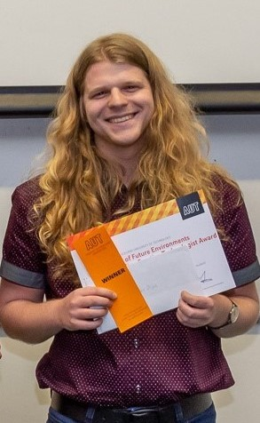

---
{: width="200" .right}
Hi, my name is Max and I'm currently a student at Auckland University of Technology (AUT).

I'm an analytically minded individual who aims to solve complex, data-driven problems through Machine Learning and Artificial Intelligence.
I enjoy discussing approaches to complex problems and aim to bring a multidisciplinary perspective to all challenges I face.

I'd love to get in touch! 
Please feel free to contact me by email at vandijcksm@gmail.com
=======
icon: fas fa-info-circle
order: 4
---

> Add Markdown syntax content to file `_tabs/about.md`{: .filepath } and it will show up on this page.
{: .prompt-tip }
>>>>>>> ad137fa2945b1870b9c1dd5e9212a5f4af7c3580
